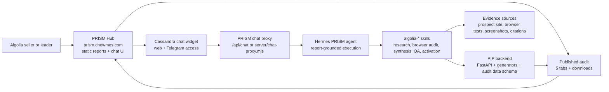
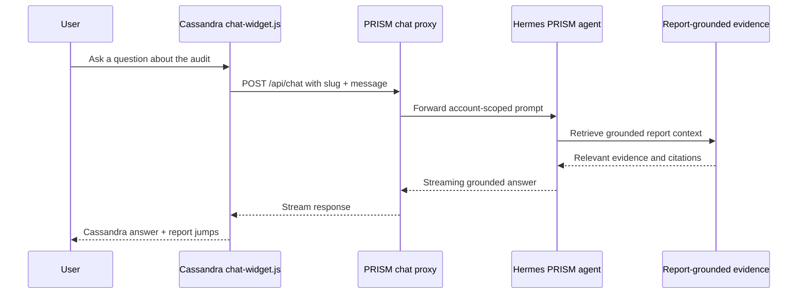

# PRISM

PRISM is the public intelligence hub for Algolia prospect search audits.

It is not just a static report site. It is the front door for a larger system:

- PRISM Hub publishes the landing page, report library, audit pages, downloadable assets, auth gate, and grounded report chat.
- PIP builds and validates the audit data behind those reports.
- Hermes runs the execution loop and report-QA path.
- Cassandra is the human-facing operator inside PRISM: the guide users meet in web chat and Telegram.
- The `algolia-*` skill suite performs the research, browser testing, synthesis, fact-checking, report rendering, and sales activation work.

The practical promise is simple: give PRISM a prospect domain; it produces a sourced search audit, sales-ready assets, and a grounded way to ask questions about the finished report.

## System Map



## Repositories And Roles

| Layer | Repository | Role |
|---|---|---|
| PRISM Hub | `github.com/arijitchowdhury80/prism` | Public frontend, report pages, static audit assets, chat widget, Vercel/serverless proxy |
| PIP backend | `github.com/arijitchowdhury80/pip` | Prospect Intelligence Platform: FastAPI backend, schemas, generators, orchestration support |
| Hermes | VPS runtime | Agent runtime that executes the PRISM report-QA path and routes work through skills |
| Skills | `github.com/arijitchowdhury80/arijit-skills` | `algolia-*` skills used by Hermes/PIP for audit production |

The repos are intentionally separate today. PRISM shows the work; PIP makes the work; Hermes runs the work; the skills do the specialized jobs.

## How PRISM Works

1. A prospect domain enters the audit workflow.
2. The `algolia-*` skills gather company, market, financial, hiring, tech stack, traffic, partner, query, and news context.
3. Browser audit skills test the prospect's live search experience and capture evidence.
4. PIP validates, normalizes, and packages the audit data.
5. PRISM publishes the audit as a five-tab report with downloadable sales assets.
6. Cassandra keeps the report accessible through grounded chat.
7. The chat proxy sends questions to Hermes with account context, and Hermes answers only from the report-grounded evidence.

## Audit Output Contract

Every modern PRISM audit is organized around five report tabs:

| Tab | What it contains |
|---|---|
| Overview | Score, gaps, account context, opportunity, and next step |
| Research | Company snapshot, financials, tech stack, traffic, hiring, signals, partners |
| Search Audit | Tested queries, scorecard, findings, screenshots, and evidence |
| Business Case | Said-vs-found hook, ROI model, proof points, case studies, why now |
| Sales Actions | Battle card, sales plays, pre-call brief, power map, ABX/outreach sequence |

Generated audits can also expose downloadable assets through the report topbar:

- AE pre-call report
- Battle card
- Prospect leave-behind
- Full audit binder / printable report
- PDF or PPTX decks where generated
- Supporting playbook or business-case source files where available

## Codebase Map

```text
/
├── index.html                    # PRISM landing page
├── reports/index.html            # Report library
├── chat-widget.js                # Cassandra web chat drawer for report pages
├── api/
│   ├── chat.js                   # Vercel serverless chat proxy to Hermes
│   └── feedback.js               # Feedback capture endpoint
├── server/
│   └── chat-proxy.mjs            # VPS/static-server chat proxy variant
├── assets/
│   ├── cassandra.png             # Cassandra portrait used by chat and landing
│   ├── grid-bg.js                # Shared animated report background
│   ├── tour/                     # Landing product-tour screenshots
│   ├── covers/                   # Report library covers
│   └── parallax/                 # Report library motion assets
├── reports/{account}/
│   ├── index.html                # Published five-tab audit SPA
│   ├── ae-report.html            # AE pre-call report
│   ├── battle-card.html          # Competitive battle card
│   ├── leave-behind.html         # Prospect leave-behind
│   ├── screenshots/              # Browser audit evidence
│   └── *.pdf / *.pptx            # Generated decks and printable assets where available
├── reports/data/*-audit-data.json # Audit data snapshots used by report pages and IA prototypes
├── ia/                           # IA prototypes and shared IA components
├── tests/
│   └── landing-page.test.mjs     # Static regression tests for landing copy, links, IA, and assets
├── package.json                  # Test script and runtime dependencies
└── README.md                     # This system map
```

## Runtime Flow For Report Chat



## Local Development

This repo is mostly static HTML with a small Node test suite.

```bash
npm install
npm test
python3 -m http.server 4173
```

Then open:

```text
http://127.0.0.1:4173/
```

## Deployment Notes

- The PRISM Hub repo remote is `https://github.com/arijitchowdhury80/prism.git`.
- Published audits live under `/reports/{account}/`; legacy root audit URLs redirect there in Vercel.
- `publish.sh` writes new generated audits to `reports/{account}/` and snapshots to `reports/data/`.
- Vercel/serverless deployment uses `api/chat.js` for report chat.
- VPS/static deployment can use `server/chat-proxy.mjs` with `HERMES_API_URL` and `HERMES_API_KEY` set in the environment.
- Never commit local `.env` files, secrets, `node_modules`, `.vercel`, or generated scratch artifacts.

## Verification

Run this before claiming a landing or report-shell change is ready:

```bash
npm test
```

For UI changes, also verify in a browser at desktop and mobile widths, checking:

- no horizontal overflow
- no console errors
- report links and downloads work
- Cassandra chat still loads the current portrait
- GitHub links point at `github.com/arijitchowdhury80/prism`
