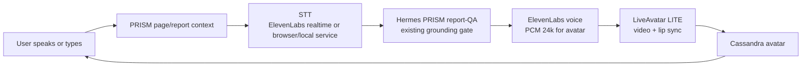
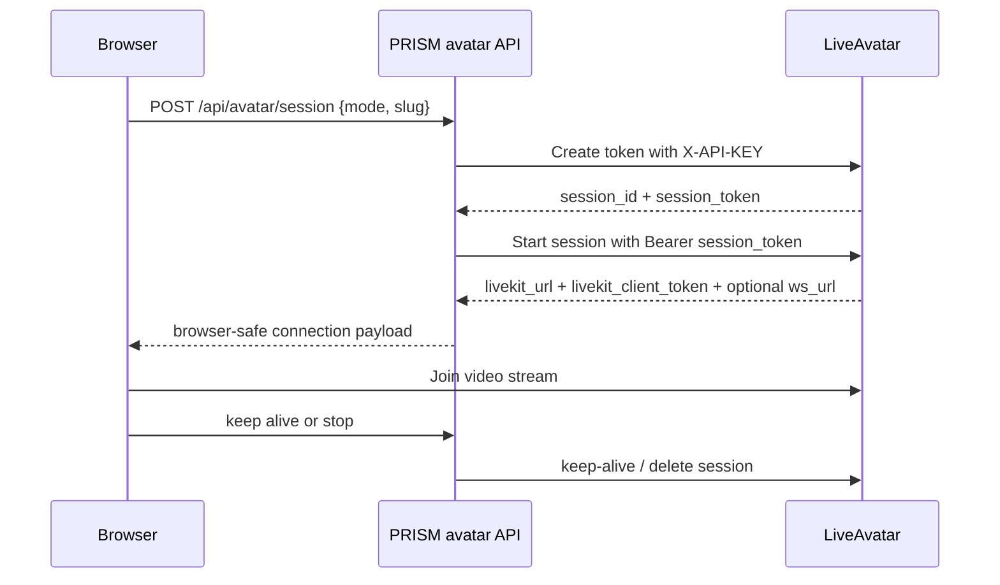
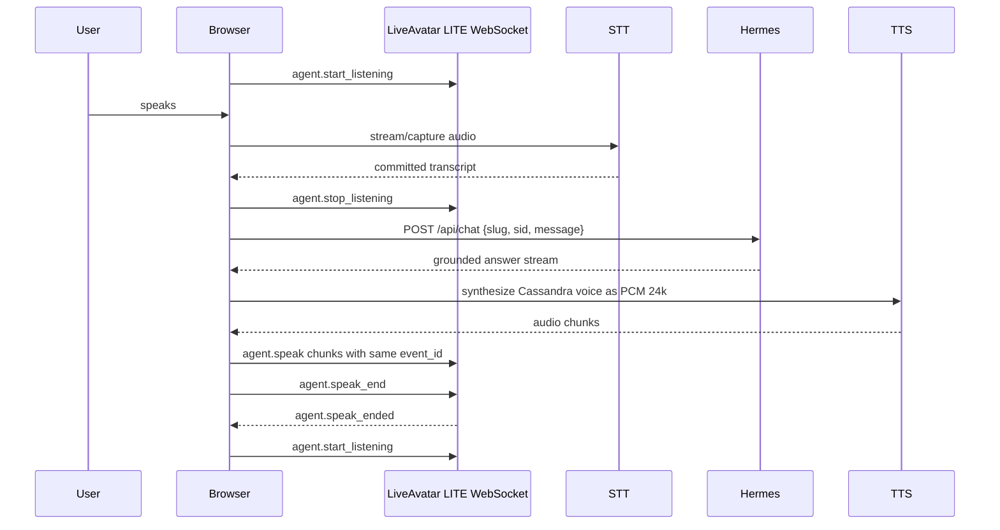

# Cassandra Live Avatar Goal And Loops

## Goal

Make Cassandra an interactive avatar experience inside PRISM without weakening the thing that makes PRISM valuable: the grounded audit system.

Cassandra should become the face and voice users can talk to, but she must not become a generic avatar chatbot. The product truth stays:

- PRISM is the system.
- The audit, evidence, screenshots, findings, and sales assets are the spine.
- Hermes is the execution and report-QA brain.
- Cassandra is the human-facing operator who makes that intelligence accessible.
- LiveAvatar renders Cassandra.
- ElevenLabs gives her a voice.

The experience should feel like talking to a sharp senior sales coach who has the audit open in front of her. She can be warm, direct, witty, and alive, but every substantive answer must come from the active PRISM report or the connected Hermes-grounded context.

## Non-Goals

- Do not rebuild avatar streaming, lip sync, WebRTC, or microphone plumbing from scratch.
- Do not make HeyGen/LiveAvatar's knowledge base the source of truth for PRISM answers.
- Do not ship Cassandra's custom face before proving the conversation loop with a stock/sandbox avatar.
- Do not expose `LIVEAVATAR_API_KEY`, `HEYGEN_API_KEY`, `ELEVENLABS_API_KEY`, or `HERMES_API_KEY` to browser code.
- Do not make Cassandra the hero over the audit. She is the operator, not the product's evidence layer.

## Recommended Path

Use the official LiveAvatar sample/sandbox avatar first, then graduate to the true Cassandra avatar.

### Phase 0: Decision And Setup

Purpose: make the architecture crisp before code.

Required decisions:

- Choose the first demo path:
  - Fast visual proof: LiveAvatar Embed or FULL sandbox.
  - Real PRISM product path: LiveAvatar LITE with Hermes-controlled answer generation.
- Confirm environment keys:
  - `LIVEAVATAR_API_KEY` or `HEYGEN_API_KEY`
  - `ELEVENLABS_API_KEY`
  - optional `ELEVENLABS_AGENT_ID`
  - existing `HERMES_API_URL`
  - existing `HERMES_API_KEY`
- Pick the first report context for testing, likely `/reports/petsmart/`, because existing PRISM chat already supports account-scoped Hermes questions.

Output:

- This goal document.
- Local-only implementation plan.

### Phase 1: Stock Avatar Visual Proof

Purpose: prove the avatar renders, starts, listens, speaks, and stops before Cassandra's face is involved.

Use official LiveAvatar sandbox/sample behavior:

- Session sandbox avatar ID for FULL/LITE: `dd73ea75-1218-4ef3-92ce-606d5f7fbc0a`
- Embed sandbox avatar ID: `65f9e3c9-d48b-4118-b73a-4ae2e3cbb8f0`
- Keep sessions local and short.
- Use backend-only session creation.

PRISM endpoints to add locally:

- `POST /api/avatar/session`
  - Reads `LIVEAVATAR_API_KEY` server-side.
  - Creates LiveAvatar sandbox session token or embed.
  - Returns only browser-safe values.
- `POST /api/avatar/stop`
  - Stops/deletes the active session to avoid leaking credits when real mode begins.

Frontend placement:

- Add or prototype an "Ask Cassandra Live" panel near the Cassandra landing section.
- In report pages, the later destination is a live option inside the existing Cassandra chat widget.
- First proof can show a stock avatar with copy that makes it clear the face is temporary.

Success evidence:

- Local browser shows avatar video.
- Microphone permission works.
- Session starts and stops without exposing API keys.
- No PRISM page overflow or console errors.

### Phase 2: Grounded Cassandra Brain Loop

Purpose: make the avatar answer from PRISM, not from generic model context.

The existing PRISM text chat already has the core grounding path:

```text
report page -> chat-widget.js -> /api/chat -> Hermes /v1/responses -> grounded answer stream
```

The avatar loop should wrap this, not bypass it.

Recommended product architecture:



Core rule:

```text
LiveAvatar is the renderer.
ElevenLabs is the voice.
Hermes is the mind.
PRISM report context is the source of truth.
```

Recommended mode:

- Use LiveAvatar LITE for the real PRISM product.
- LITE expects PRISM to bring STT, LLM, and TTS.
- That is exactly what we want because Hermes must control the answer.

Alternative for an intermediate proof:

- Use FULL + Custom LLM only if Hermes can expose an OpenAI-compatible chat-completions endpoint for LiveAvatar.
- This is faster than a full LITE pipeline, but it gives LiveAvatar more orchestration responsibility and should not become the long-term architecture unless it preserves all PRISM grounding guarantees.

## Core Runtime Loops

### 1. Session Lifecycle Loop

This keeps the avatar alive safely.



Rules:

- API key stays server-side.
- Browser receives only session/browser tokens safe for client use.
- Keep-alive runs every 2-3 minutes for live sessions.
- Stop/delete runs on close, route change, or explicit hang-up.

### 2. Conversation Turn Loop

This is the human interaction loop.



Rules:

- Do not send LiveAvatar LITE events before `session.state_updated: connected`.
- Send all audio chunks for one answer with the same `event_id`.
- Send `agent.speak_end` after the final audio chunk.
- Wait for `agent.speak_ended` before returning to listening.
- If the user interrupts, stop the local audio send loop and then send `agent.interrupt`.

### 3. Grounding Loop

This protects PRISM from becoming a generic avatar demo.

```text
User asks question
  -> attach report slug and session id
  -> Hermes receives account-scoped prompt
  -> Hermes retrieves report evidence
  -> Cassandra answers with grounded substance
  -> UI shows that the answer is grounded in the active audit
  -> missing evidence becomes "not in this audit", not hallucination
```

Required invariants:

- Every avatar turn includes the active report slug when on a report page.
- Landing page demo questions must either use a sample audit or clearly state they are a product demo.
- Cassandra cannot invent claims about a prospect, ROI, competitors, search defects, or sales plays.
- The answer loop should preserve the same account-scoped session key pattern as current `/api/chat`.

### 4. Voice And Identity Loop

This makes Cassandra feel alive without letting personality outrun evidence.

Progression:

1. Stock LiveAvatar face + generic sandbox voice.
2. Stock LiveAvatar face + Cassandra voice.
3. Cassandra portrait/video custom avatar + Cassandra voice.
4. Full Cassandra live experience embedded into PRISM reports and landing page.

Voice constraints:

- Rendered launch/trailer videos can use ElevenLabs high-expressiveness voice models.
- Interactive mode should prefer low-latency output.
- For LiveAvatar LITE, TTS output must be raw PCM, mono, signed 16-bit, 24 kHz, base64 encoded over the avatar WebSocket.

Personality constraints:

- Cassandra can be crisp, direct, warm, and lightly irreverent.
- Cassandra should sound like a senior sales coach, not a scripted bot.
- Cassandra should avoid theatrical self-mythologizing.
- Cassandra should always return to the audit, the evidence, the sales motion, and the next useful action.

### 5. Product Feedback Loop

This decides whether the avatar deserves to stay central.

Test questions:

- Does the avatar help a seller understand the audit faster than text chat alone?
- Does it make PRISM feel more alive without making it feel less serious?
- Does it encourage better questions?
- Does it make the audit more usable on WhatsApp/video/social?
- Does it preserve trust when the answer is constrained by evidence?

Signals to collect:

- Time to first useful answer.
- User asks follow-up without prompting.
- User can explain what PRISM does after watching/talking for 30 seconds.
- User trusts the answer because it points back to the audit.
- User does not mistake Cassandra for the entire product.

## Implementation Architecture

### Backend

Add a PRISM avatar service beside the existing chat proxy.

Candidate files:

- `api/avatar-session.js` for Vercel/serverless.
- `server/chat-proxy.mjs` routes for VPS/static deployment.

Responsibilities:

- Create LiveAvatar sessions.
- Start sessions.
- Return browser-safe video connection payloads.
- Stop sessions.
- Keep secrets server-side.
- Optionally proxy ElevenLabs TTS if direct browser use is not appropriate.

### Frontend

Add a Cassandra Live module.

Candidate files:

- `cassandra-live.js` for shared browser behavior.
- landing page integration in `index.html`.
- later report-page integration inside `chat-widget.js`.

Responsibilities:

- Render the avatar panel.
- Request session from backend.
- Attach LiveAvatar video.
- Manage mic state.
- Show transcript and grounded-answer state.
- Handle interruption and stop.

### Existing PRISM Chat Reuse

The current text path remains authoritative:

- `api/chat.js`
- `server/chat-proxy.mjs`
- `chat-widget.js`

Avatar should call into the same grounded path or a strict wrapper around it.

## Build Order

1. Create local-only sandbox avatar endpoint.
2. Render stock LiveAvatar in a local Cassandra Live panel.
3. Verify session start/stop, mic, video, and no secret exposure.
4. Connect text input to existing `/api/chat` for grounded answers.
5. Add TTS and route the audio into LiveAvatar LITE.
6. Add STT/mic turn-taking.
7. Add interruption and keep-alive.
8. Move from stock avatar to Cassandra voice.
9. Move from stock avatar to Cassandra custom avatar.
10. Promote from landing-page prototype to report-page experience.

## Verification Gates

Before claiming the avatar experience works:

- `npm test` passes.
- Local PRISM page renders without console errors.
- No horizontal overflow on desktop or mobile.
- LiveAvatar API key is absent from browser source, network payloads, and static files.
- Session starts and stops through backend.
- Sandbox avatar renders video locally.
- User can complete one full turn: speak or type -> grounded answer -> avatar speaks -> returns to listening.
- The answer matches the active audit context.
- Missing evidence is refused honestly.
- Session teardown is verified.

## First Local Prototype Definition

The first prototype is not "Cassandra is alive." It is:

> A stock LiveAvatar demo face appears inside a local PRISM Cassandra Live panel, starts through a backend-safe PRISM endpoint, can be stopped cleanly, and is positioned as the future Cassandra interface while the existing Hermes chat path remains the source of grounded answers.

That is the right first loop because it proves the risky platform mechanics before spending effort on Cassandra's custom likeness.
